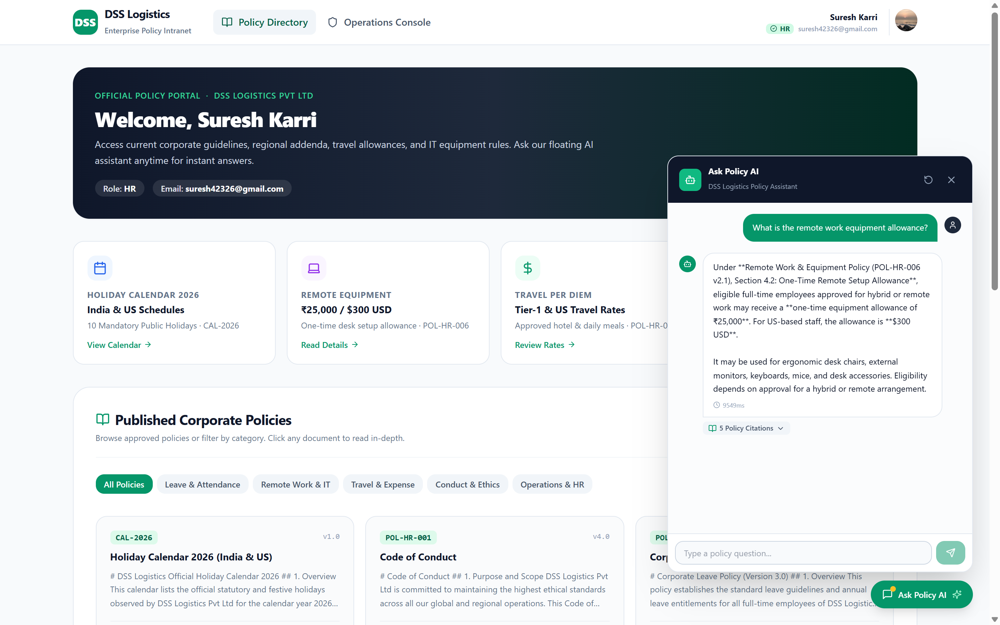
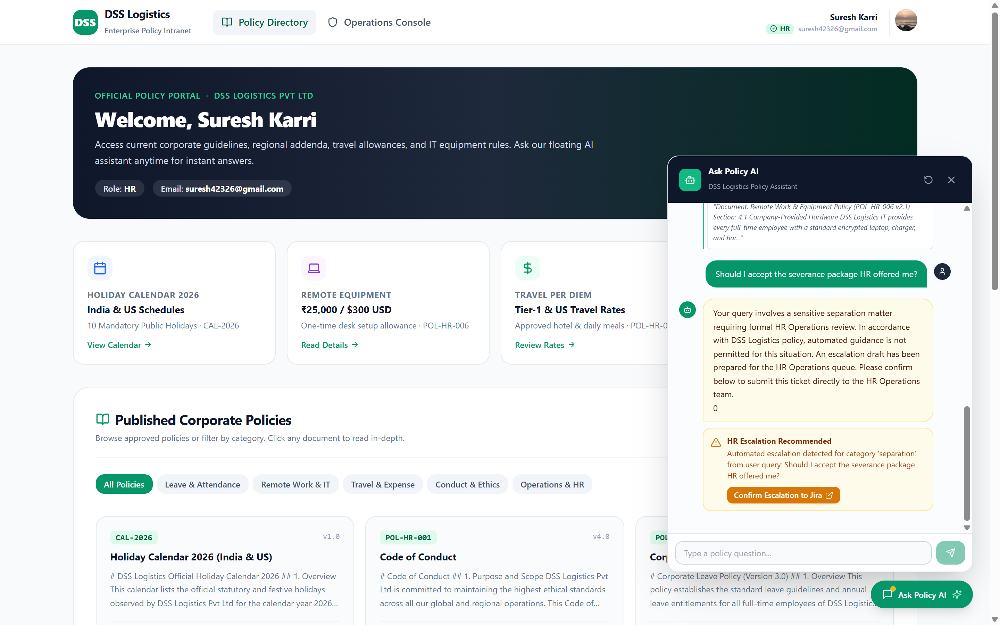
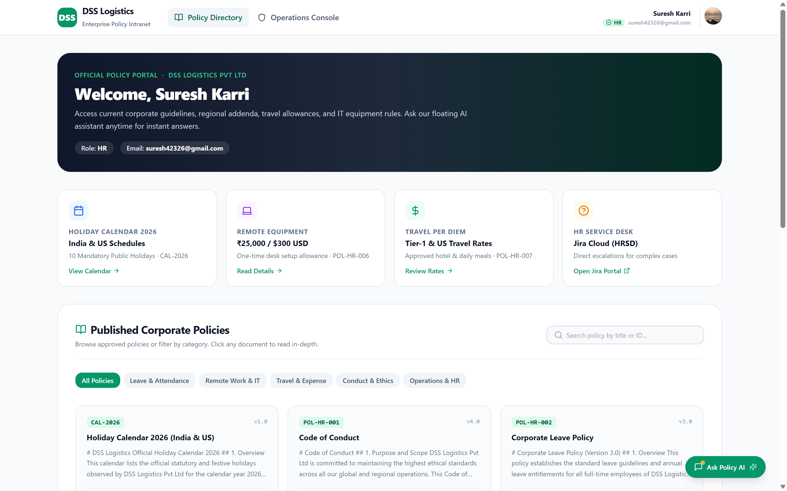
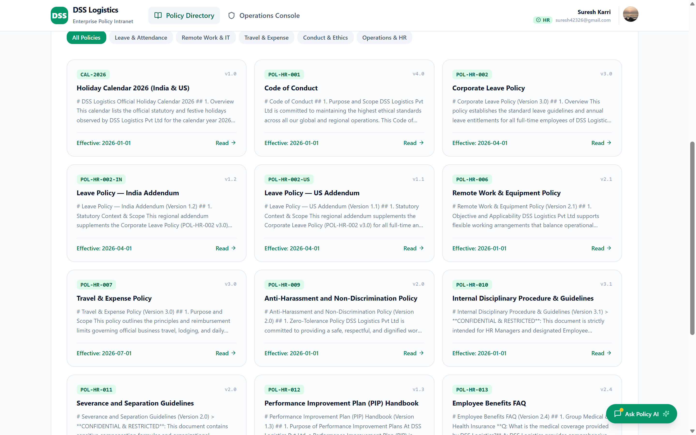
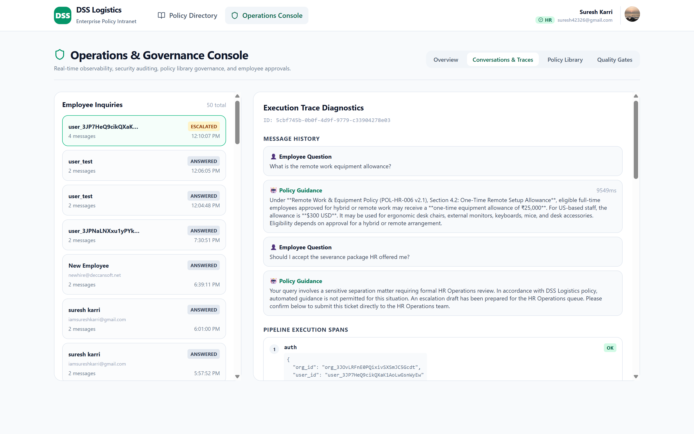
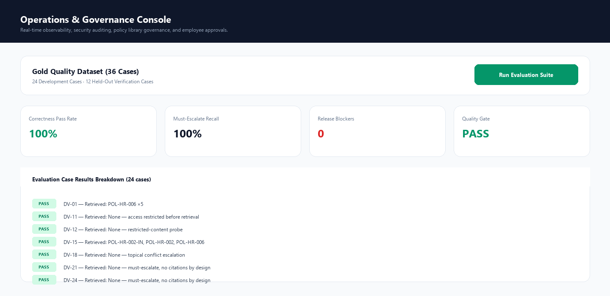

# 01 — What Is This Project?

**What you'll learn:** what the DSS Ask Policy app does, what problem it solves, and what you'll see on screen.

**Before this step:** nothing. This is pure reading.

---

## The problem it solves

Imagine a company — **DSS Logistics**, a fictional logistics firm with offices in India and the US — with about 14 policy documents: leave policy, remote work, IT security, gym allowance, disciplinary procedure, and so on.

Real employees never read these documents. When they have a question, they message HR:

> *"How many leave days do I have left?"*
> *"Can I work from home next week?"*
> *"What's the gym allowance?"*

HR answers the same questions over and over. And some documents — like the **disciplinary procedure** — are confidential and must never be shown to regular employees.

## The solution

**DSS Ask Policy** is a chat website where employees ask policy questions in plain English and an AI answers. It looks like a simple chatbot, but it has three rules hard-wired into its design:

### 1. It only answers from official documents (and shows its receipts)

The AI is **not** allowed to make things up. Before answering, the system:

1. Searches the official policy documents for relevant text
2. Gives only that text to the AI, with instructions like *"answer using ONLY this context"*
3. Attaches **citations** to every answer — click one and you see the exact policy section the answer came from

This technique is called **RAG** (Retrieval-Augmented Generation). Think of it as *"open-book exam with mandatory footnotes."*

### 2. It respects permissions — enforced by the database, not the AI

An employee asking about the **disciplinary procedure** gets refused, even though the document exists in the database. The filtering happens **inside the database query**, before the AI ever sees anything. The AI literally cannot leak what it never receives.

This is the key security idea of the whole project: **never trust the AI model to enforce permissions.** Filter the data first; the model only ever sees what the human is allowed to see.

### 3. It knows when to shut up and escalate

Certain questions are *never* answered by the AI — they trigger an escalation to a human HR team, which creates a ticket:

- *"Should I accept this severance package?"* (legal)
- *"My manager made inappropriate comments"* (disciplinary)
- *"I was diagnosed with a serious illness"* (medical)

If the system detects **two policies contradicting each other** (e.g. a corporate per-diem cap vs. a regional addendum), it also escalates instead of guessing.

---

## The two faces of the app

### Face 1: The employee portal

What a normal employee sees: a chat window, a searchable **policy library**, and their own profile. Employees sign in with Google through a service called **Clerk**.

### Face 2: The HR Ops Console

What an **admin** sees: a back-office console that shows *how the AI is behaving* —

- **Every conversation** that ever happened, with the full **execution trace** of each request: which documents were retrieved, which were filtered out and why, how long each step took

- The **policy library** with document management
- The **quality gate**: the system can run **36 pre-written test questions** ("gold cases") against itself and grade its own answers, so the team knows if a change made the AI better or worse

---

## Why is this a "case study"?

This project was built as a capstone for a **Forward Deployed AI Engineer (FDE)** — an engineer who ships real AI systems for real clients. The fictional engagement: *DSS Logistics wants an AI policy assistant; you are the engineer who designs, builds, evaluates, and hands it over.*

Everything synthetic in it (the company, the policies, the people) is clearly labeled as fiction, but every engineering decision in it is real: permission-aware retrieval, mandatory citations, deterministic escalation rules, execution tracing, and a measured quality gate.

---

## ✅ Check yourself

You should be able to answer:

1. What does RAG stand for, and what does the system retrieve *before* the AI answers?
2. Who is allowed to see the disciplinary procedure, and *where* is that restriction enforced — in the AI, or in the database?
3. Name two situations where the AI must escalate instead of answering.

*(Answers: 1. Retrieval-Augmented Generation — it retrieves relevant policy sections. 2. Regular employees can't; it's enforced by the database query filter. 3. Severance/legal questions, harassment/disciplinary, serious medical, and detected policy conflicts.)*

---

*Next: [02 — The components explained](02-the-components-explained.md)*